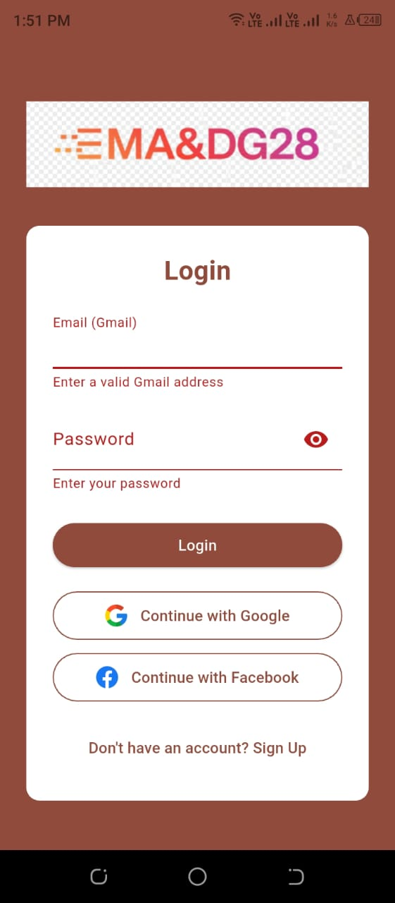
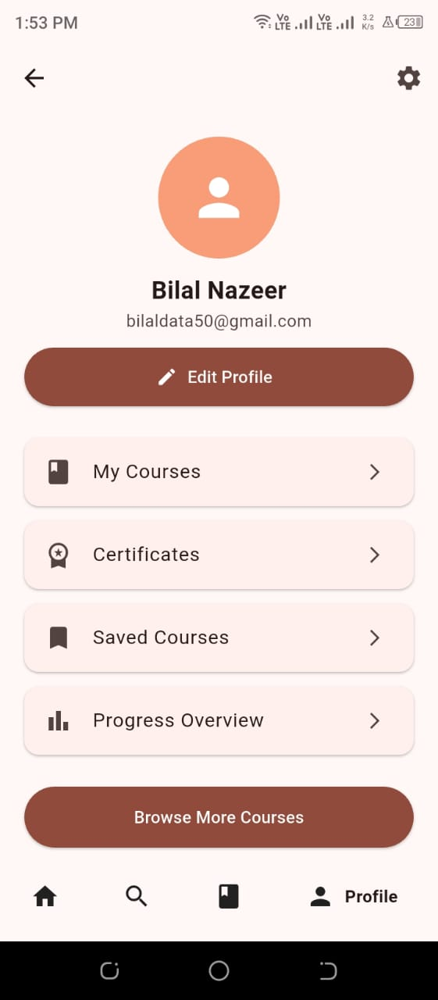
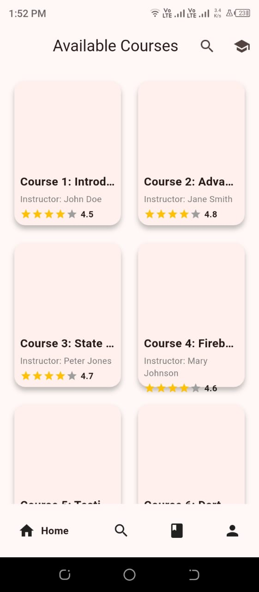
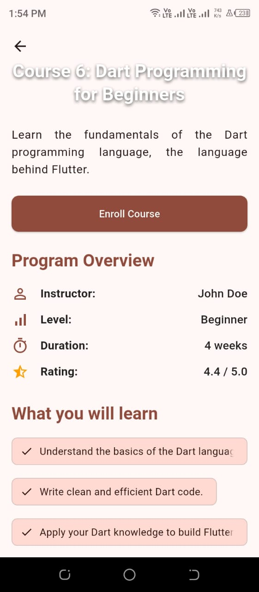
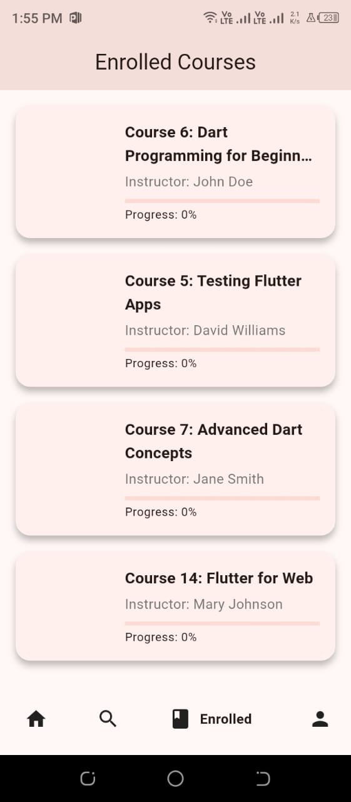
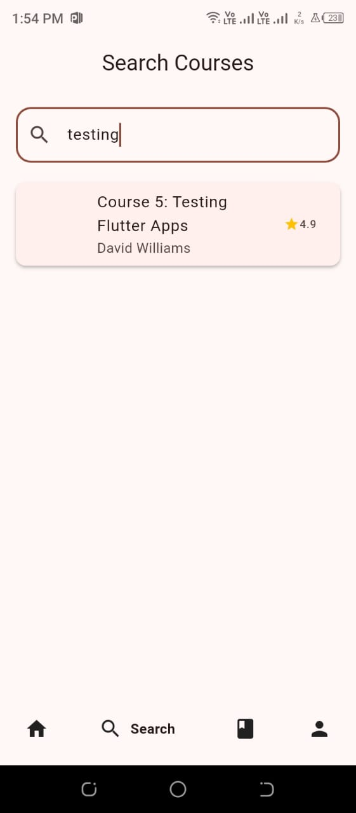
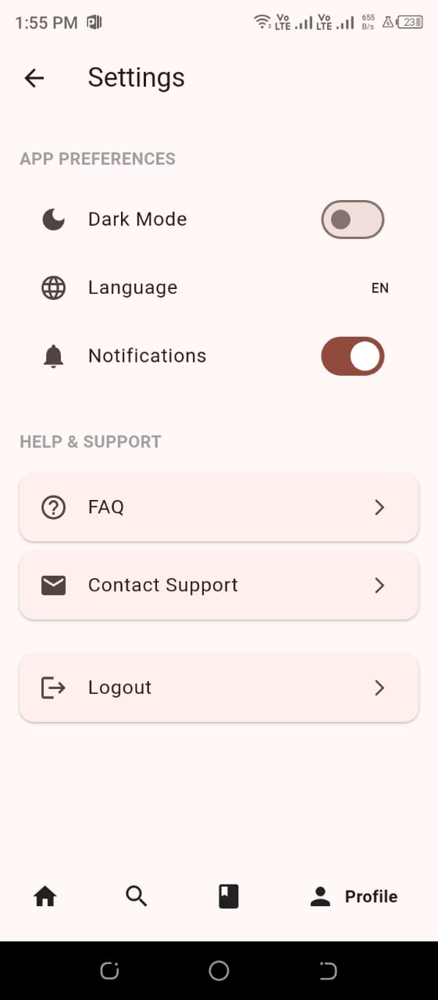

# MADG28 – Online Learning Platform

This is a Flutter based online learning platform. Users can explore courses, enroll, keep track of learning progress and manage their profile. The UI is clean and simple. The app supports both light and dark themes and multiple languages.

## 🚀 Features

* Secure login and signup
* Mock Google and Facebook style login
* Browse course catalog with details and ratings
* Enroll in courses and track progress
* Course detail screen with lessons and outcomes
* Search courses by keywords
* User profile with update options
* View enrolled courses
* Data stored locally with `shared_preferences`
* Supports English, Spanish, French and German
* Light and Dark mode

## 🛠️ Getting Started

### Requirements

* Flutter SDK
* Dart (comes with Flutter SDK)

### Installation

```sh
git clone https://github.com/your_username/madg28.git
cd madg28
flutter pub get
flutter run
```

## 📦 Dependencies

Important packages used:

* `flutter`
* `provider` for state management
* `shared_preferences` for local storage
* `flutter_localizations` and `intl` for localization
* `image_picker`
* `google_nav_bar`
* `flutter_rating_bar`
* `skeletonizer`

Full list is available inside `pubspec.yaml`.

## Mocking

Login and API data is mocked in this version. Courses and user authentication are simulated using local JSON data. No backend is required to run the app.

## 📁 Directory Structure

* `lib/`

  * `models/`
  * `notifiers/`
  * `providers/`
  * `screens/`
  * `widgets/`
  * `l10n/`
* `assets/`
* `test/`

## 📸 Screenshots - App Screens


## App Screenshots

###  Login Screen


###  Profile Screen


###  Edit Profile


###  Course Details


###  Course Listing


###  Enrolled Courses


###  Search by Name


###  Settings Screen



## 🌐 State Management

This app uses the `provider` package to manage state. UI and logic are kept separate for better clarity.

## 🌍 Localization

Multiple language support is handled with `flutter_localizations` and `intl`. The locale can be changed inside the app.

## 🎨 Theming

Both light and dark themes are available. Users can switch themes and the app remembers the selected theme automatically.

## 🤝 Contributing

You can contribute by opening issues or pull requests.

* Fork the repo
* Make a feature branch
* Commit your changes
* Push and create a pull request

